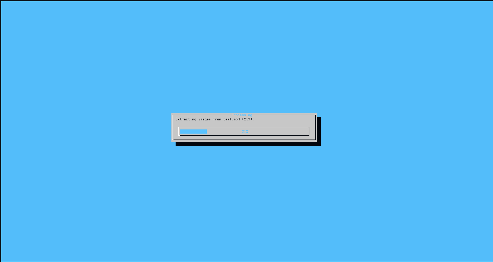
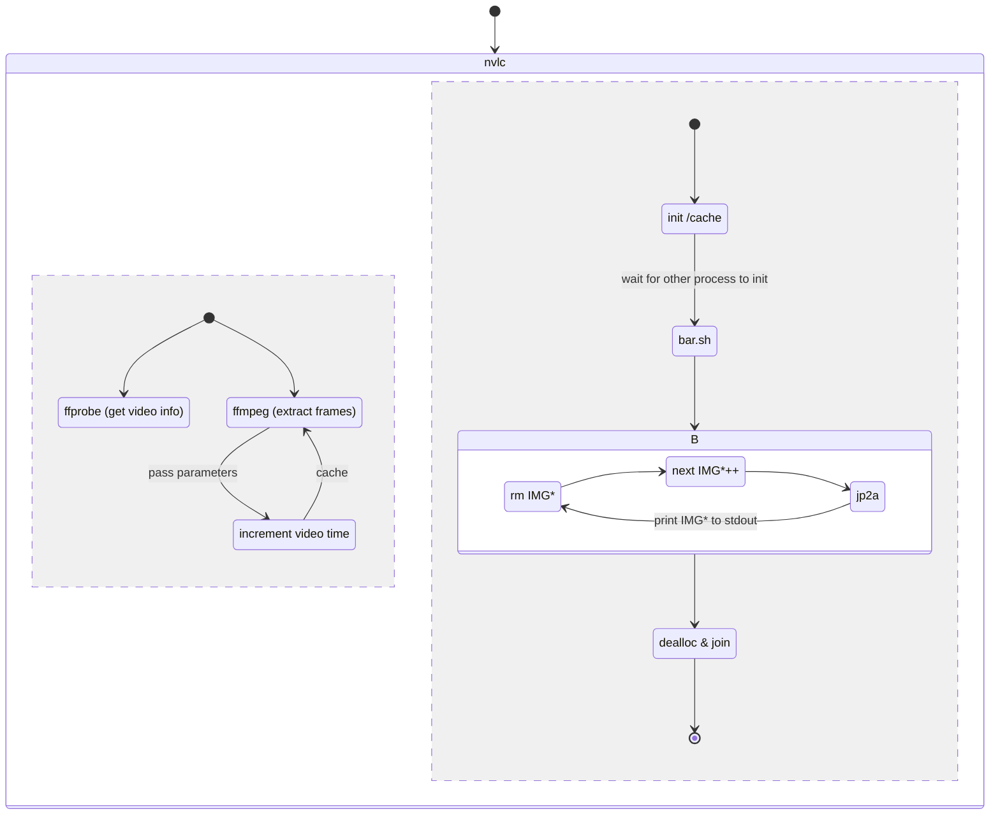

# nVLC
nVLC is a ncurses based video player from the terminal. It currently support terminal scaling and operates with fixed 18 FPS.  
Compile with `gcc main.c -o nvlc -lpthread`
## Images
[comment]: <> (TODO video selection & performance issue)

# The idea

